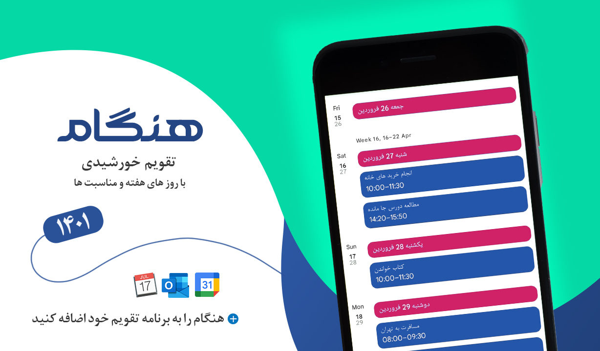

# هنگام

## هنگام چیست؟
هنگام یک افزونه 📆تقویم خورشیدی است که می تواند به برنامه تقویم 📱گوشی یا 💻لپ تاب شما اضافه شود.
## چرا هنگام؟
اهل برنامه ریزی برای وقت تون هستید؟ از جدول کشیدن روی کاغذ خسته شدید؟🤦‍♂️ حالا وقتشه یک برنامه تقویم نصب کنید.

ولی برنامه های تقویم که میلادی هستند چه کار کنم؟😥

راستش هنگام اینجاست که کمک تون کنه...😁

برنامه تقویم گوشی یا لپ تاب تون رو فارسی کنید و براحتی برنامه ریزی کنید.
دیگه یادتون نمیره تو چه ساعتی باید چه کاری رو انجام میدادید.

## اضافه کردن
برای اضافه کردن تقویم خورشیدی هنگام به برنامه تقویم خود، فایل موجود در پوشه 
[hengam1401](./hengam1401/)
را بارگیری کنید.
سپس در برنامه تقویم خود آن را وارد (ایمپورت) کنید.
### راهنمای اضافه کردن تقویم به
- [Google Calendar](https://support.google.com/calendar/answer/37118?hl=en&co=GENIE.Platform%3DDesktop)
- [Microsoft Outlook](https://support.microsoft.com/en-us/office/import-calendars-into-outlook-8e8364e1-400e-4c0f-a573-fe76b5a2d379)
- [Apple Calendar](https://support.apple.com/en-gb/guide/calendar/icl1023/mac)

 برای اضافه کردن مستقیم هنگام به گوگل‌کلندر، در قالب یک تقویم جداگانه، روی لینک زیر بزنید، و بعد از باز شدن آن، گزینه + در پایین صفحه را کلیک کنید تا هنگام به تقویم گوگل‌تان اضافه شود 
- [Add Directly to Google Calendar](https://calendar.google.com/calendar/embed?src=lmjk2a8bh5s5npl076pjgsc4q4%40group.calendar.google.com&ctz=Asia%2FTehran)

## نکته ای شایان ذکر
مناسبت روز هاي اين تقويم از منابع زير كه ذكر شده اند برداشته شده است.
برخي از مناسبت ها گرچه مشهور و ثبت شده هستند ولي در برخي موارد نزد صاحب نظران، منبع درست و استواري ندارند.
براي مثال استاد بزرگوار شعر و ادب پارسي شفيعي كدكني در کانال تلگرام خود از دکتر جلال خالقی مطلق در پیامی به بنیاد فردوسی
، نقل می کنند که که روز تولد فردوسی مصادف با یکم بهمن ماه فاقد اعتبار است.
[لینک تلگرام](https://t.me/shafiei_kadkani/2303)

## منابع
- [ساعت و تقویم ایران](https://www.time.ir/)
- [بادصبا](https://badesaba.ir/)
